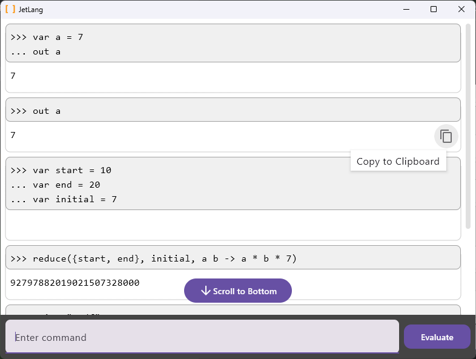

# JetLang

A toy calculator language with fully functional REPL user interface.

Useful for performing calculations.

# Features
- decimals are represented accurately: `0.1 + 0.2` will be `0.3`
- concurrent evaluation of `map` and `reduce` operations
- "Cancel" button
- repl command history search with up/down
- <kbd>Ctrl</kbd> + <kbd>Return</kbd> to execute the current command
- "Scroll to Bottom" button
- "Copy to Clipboard" button
- non-blocking evaluation

### implemented with

- [Kotlin](https://github.com/JetBrains/kotlin)
- [Coroutines](https://github.com/Kotlin/kotlinx.coroutines) for concurrency
- [Compose Multiplatform](https://github.com/JetBrains/compose-multiplatform) for the UI
- [Kudzu](https://github.com/copper-leaf/kudzu) for the parser
